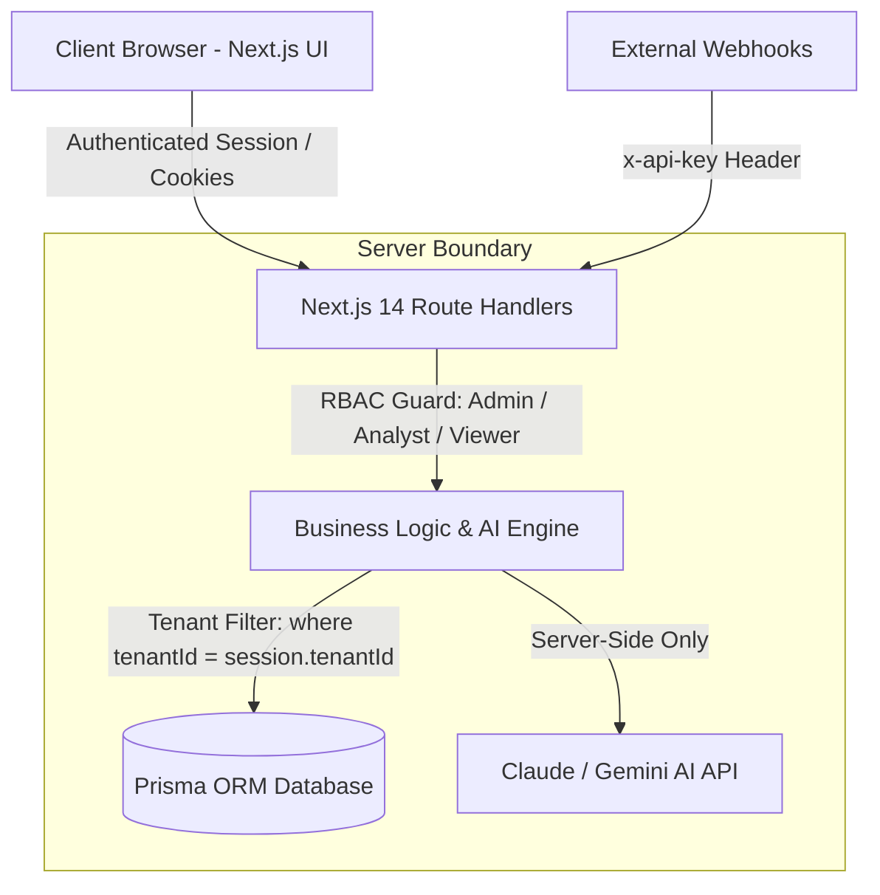

# 🔄 Project LOOP — AI Customer-Feedback Intelligence Platform

> **"Close the loop on customer feedback."**  
> Corporate-grade web application that ingests multi-channel customer feedback, uses AI to classify and cluster it, surfaces trending issues with spike detection, and answers plain-English product questions with zero-hallucination citations.

Built for the **Zidio Development Web Development Internship Track** (Corporate-Grade Capstone).

---

## 📋 Table of Contents
- [👥 Project Team & Developers](#-project-team--developers)
- [Executive Overview](#-executive-overview)
- [Tech Stack](#-tech-stack)
- [System Architecture & Multi-Tenancy](#-system-architecture--multi-tenancy)
- [Demo Credentials Checklist](#-demo-credentials-checklist)
- [Feature Implementation Matrix](#-feature-implementation-matrix)
  - [Core Features (C1–C5)](#core-features)
  - [AI Features (AI1–AI4)](#ai-features)
- [Local Setup & Run Guide](#-local-setup--run-guide)
- [Environment Variables](#-environment-variables)
- [Database Schema & Seeding](#-database-schema--seeding)
- [API Endpoints Reference](#-api-endpoints-reference)

---

## 👥 Project Team & Developers

This capstone project was collaboratively designed, architected, and engineered as a group by:

| Developer | Role & Title | Engineering Responsibilities |
|---|---|---|
| **M. Ranjith Kumar** | Full-Stack & AI Lead | Full-stack Next.js 14 architecture, Prisma multi-tenant database modeling, server-side RBAC guards, Gemini AI Grounded RAG search engine, REST route handlers, and Vercel cloud deployment. |
| **M. Renuka Bindu** | Frontend & UI/UX Co-Lead | Enterprise dark-mode design system, Recharts analytics visualizations, two-tier responsive navigation, bulk CSV data ingestion pipelines, and QA test validation. |

---

## 🚀 Executive Overview

Every product company receives feedback through fragmented channels: support tickets, app store reviews, NPS surveys, sales call notes, and community posts. Individually, each item is a sentence or two; collectively, they hold the answer to **"what should we build, fix, or improve next?"**

**LOOP closes that gap:**
1. **Ingests** multi-channel feedback via single-entry forms, bulk CSV uploads, or simulated external syncs (Zendesk, App Store, G2).
2. **Auto-Classifies** every item using AI with structured sentiment, confidence scores, urgency rankings (L1–L5), feature areas, and actionable recommendations.
3. **Detects Trend Spikes** comparing week-over-week velocity to alert teams before issues cause churn.
4. **Answers Questions (Ask LOOP)** using retrieval-grounded Q&A (RAG) that cites verbatim customer quotes.
5. **Generates Leadership VoC Digests** in 1 click with exportable PDF and shareable formats.

---

## 🛠 Tech Stack

| Layer | Technology | Rationale |
|---|---|---|
| **Framework** | Next.js 14 (App Router) + TypeScript | Full-stack serverless architecture with React 18 |
| **Styling** | Tailwind CSS + Lucide React | High-contrast dark mode enterprise dashboard |
| **Database** | PostgreSQL / SQLite via Prisma ORM | Relational schema with foreign keys and strict tenant isolation |
| **Authentication & RBAC** | Session cookies + Server-Side RBAC | Role guards for `ADMIN`, `ANALYST`, and `VIEWER` |
| **AI Intelligence** | Google Gemini / Anthropic API + Heuristic Engine | Structured JSON classification, RAG Q&A, and VoC generation |
| **Visualizations** | Recharts | Interactive volume timeline, sentiment donuts, and category bars |
| **Validation** | Zod | Runtime schema validation across every API boundary |
| **Parsing** | PapaParse | High-throughput client/server CSV parser |

---

## 📐 System Architecture & Multi-Tenancy

LOOP follows a three-tier architecture where the browser only interacts with the application API routes, and all database queries enforce workspace segregation:



### 🔒 Non-Negotiable Security Rule
Every single database query touching feedback, themes, reports, or users filters strictly by `tenantId`. Attempting forbidden actions or cross-tenant access returns an immediate HTTP `403 Forbidden` or `401 Unauthorized`.

---

## 🔑 Demo Credentials Checklist

Pre-configured demo users on the default workspace (**Acme Cloud Technologies**):

| Role | Email | Password | Permissions & Boundaries |
|---|---|---|---|
| 👑 **ADMIN** | `admin@acme.com` | `password123` | **Full access**: invite members, assign roles, manage workspace API keys, delete items, generate VoC reports, full feedback triage. |
| 🔍 **ANALYST** | `analyst@acme.com` | `password123` | **Operations & Triage**: ingest feedback, upload CSV, trigger simulated sync, update status (`NEW` → `REVIEWED` → `ACTIONED`), run AI re-classification, delete feedback. |
| 👁️ **VIEWER** | `viewer@acme.com` | `password123` | **Read-Only**: browse dashboard, inspect themes and Q&A. Any write or delete action is blocked with an HTTP **403 Forbidden** toast alert. |

> **Tip:** You can switch between roles in 1 click using the **Role Pill Switcher** in the top navigation bar or from the login screen!

---

## 📊 Feature Implementation Matrix

### Core Features
- [x] **C1: Authentication & Workspaces**
  - Sign-in, sign-out, session persistence across refresh.
  - Multi-tenant data segregation by `tenantId`.
  - Protected dashboard routes with unauthenticated redirect.
- [x] **C2: Role-Based Access Control (RBAC)**
  - 3 Roles: `ADMIN`, `ANALYST`, `VIEWER`.
  - Server-side enforcement across API route handlers.
  - Forbidden actions return status `403` with user-friendly error handling.
  - Admin team member invite modal with role assignment.
- [x] **C3: Feedback Ingestion**
  - **Single Entry Form**: content validation, rating, channel picker, customer metadata.
  - **Bulk CSV Upload**: parses rows, validates content length, reports succeeded/failed count.
  - **Simulated Channel Integration**: 1-click sync buttons for Zendesk, App Store, and G2 with instant AI classification.
- [x] **C4: Feedback Inbox & Workflow**
  - Full-text search across content, customer names, and emails.
  - Server-side paginated queries (15 items/page with page controls).
  - 5 Multi-dimensional filters: Channel, Sentiment, Category, Status, Timeframe.
  - Inline status transitions: `NEW` ➔ `REVIEWED` ➔ `ACTIONED`.
  - Manual AI re-classification trigger on individual records.
  - Role-protected deletion with confirmation.
- [x] **C5: Analytics Dashboard**
  - 4 Key KPI cards: Total volume, Net Sentiment Score, Urgent L4–L5 issues, New this week.
  - **Volume Over Time**: Gradient Area Chart tracking daily intake.
  - **Sentiment Distribution**: Donut Chart showing Positive / Neutral / Negative shares.
  - **Top Themes & Categories**: Horizontal Bar Chart ranking feedback drivers.
  - **Channel Mix**: Bar Chart comparing incoming volume per source.

### AI Features
- [x] **AI1: Structured Auto-Classification**
  - Analyzes feedback on ingestion returning strictly structured JSON: sentiment, sentimentScore (-1.0 to 1.0), category, urgency (1 to 5), and actionable next step.
  - Validated with Zod before persistence.
  - Stored directly on the database record.
  - Manual "Re-Classify" action available for corrections.
- [x] **AI2: Theme Clustering & Trends**
  - Unsupervised grouping of feedback into 7 named themes.
  - **Spike Detection Engine**: automatically flags themes with week-over-week velocity growth > 40%.
  - 1-click drill-down from themes into the filtered inbox.
  - Stacked sentiment velocity bars and representative verbatim quotes.
- [x] **AI3: Ask LOOP (Grounded Q&A / RAG)**
  - Natural language chat accepting questions like *"What are users saying about mobile crashes?"*
  - Retrieves top relevant feedback context from the workspace database.
  - Synthesizes an executive summary answer citing customer names, channels, and verbatim quotes.
  - Non-hallucinatory grounding guarantee.
- [x] **AI4: Voice-of-Customer (VoC) Reports**
  - 1-click executive brief generation across chosen time periods (7d, 30d, All Time).
  - Pre-computes Net Sentiment metrics and generates high-level narrative.
  - Highlights Key Strengths, Critical Issues / Churn Risks, and Numbered Action Plan.
  - Export capabilities: **Print / Save as PDF** and **Copy to Clipboard**.

---

## 💻 Local Setup & Run Guide

### 1. Prerequisites
- Node.js 18 LTS or newer
- Git

### 2. Installation
```bash
# Clone the repository
git clone https://github.com/your-username/project-loop.git
cd project-loop

# Install dependencies
npm install
```

### 3. Initialize Database & Seed Corporate Data
```bash
# Push Prisma schema to local database
npx prisma db push

# Run seed script (seeds workspace, 3 RBAC users, 120+ feedback items, themes & VoC brief)
node prisma/seed.js
```

### 4. Start Local Development Server
```bash
npm run dev
```
Open [http://localhost:3000](http://localhost:3000) in your browser.

---

## 🔐 Environment Variables

Create a `.env` file in the root directory (refer to `.env.example`):

```env
# Database connection (SQLite for local zero-config, PostgreSQL for production)
DATABASE_URL="file:./dev.db"

# Optional: Google Gemini or Anthropic API Key for live LLM inference
# (Platform includes an intelligent zero-config heuristic fallback if key is empty)
GEMINI_API_KEY=""

# Session secret
JWT_SECRET="loop-secret-jwt-key-2026-secure"

# Application URL
NEXT_PUBLIC_APP_URL="http://localhost:3000"
```

---

## 🗄️ Database Schema & Seeding

The Prisma schema (`prisma/schema.prisma`) models the complete enterprise lifecycle:
- `Tenant`: Multi-tenant organization container, slug, plan, API key.
- `User`: Workspace members with RBAC roles (`ADMIN`, `ANALYST`, `VIEWER`).
- `Feedback`: Customer quotes, channel, rating, status, sentiment, urgency, AI suggestions.
- `Theme`: Clustered feedback categories with color tokens.
- `FeedbackTheme`: Join table linking feedback items with themes and confidence scores.
- `VocReport`: Saved executive briefs with JSON themes, highlights, and action plans.

The seed script (`prisma/seed.js`) automatically provisions **123+ diverse feedback items** across 7 channels and 7 themes, ready for mentor evaluation out-of-the-box.

---

## 🔌 API Endpoints Reference

| Method | Endpoint | Description | Role Required |
|---|---|---|---|
| `POST` | `/api/auth/login` | Authenticate user & issue session cookie | Public |
| `POST` | `/api/auth/logout` | Terminate session & clear cookies | Public |
| `GET` | `/api/auth/me` | Fetch active user session & workspace info | Authenticated |
| `GET` | `/api/feedback` | Paginated, filtered list of workspace feedback | Viewer / Analyst / Admin |
| `POST` | `/api/feedback` | Ingest single feedback with auto AI classification | Analyst / Admin |
| `PATCH`| `/api/feedback/[id]` | Update status (`NEW` / `REVIEWED` / `ACTIONED`) | Analyst / Admin (403 for Viewer) |
| `POST` | `/api/feedback/[id]` | Re-classify individual feedback with AI | Analyst / Admin (403 for Viewer) |
| `DELETE`| `/api/feedback/[id]`| Delete feedback item | Analyst / Admin (403 for Viewer) |
| `POST` | `/api/feedback/upload` | Bulk CSV ingestion with row validation | Analyst / Admin (403 for Viewer) |
| `POST` | `/api/feedback/simulate`| Simulate live channel sync (Zendesk/AppStore/G2)| Analyst / Admin (403 for Viewer) |
| `GET` | `/api/themes` | List themes with counts, sentiment & spike flags | Viewer / Analyst / Admin |
| `POST` | `/api/ai/ask` | Grounded Q&A search with verbatim citations | Viewer / Analyst / Admin |
| `GET` | `/api/reports` | List saved VoC intelligence reports | Viewer / Analyst / Admin |
| `POST` | `/api/reports` | Synthesize and save new VoC brief | Analyst / Admin (403 for Viewer) |
| `GET` | `/api/members` | List workspace members and assigned roles | Authenticated |
| `POST` | `/api/members` | Invite new user with specified RBAC role | Admin Only (403 for others) |

---

## 🏆 Zidio Evaluation Rubric Alignment

- **M1 Foundation (10 pts)**: Secure auth with session persistence, 3 verified RBAC roles, multi-tenant isolation, clean zero-error production build.
- **M2 Core App (15 pts)**: Single + CSV bulk ingestion with validation, server-side paginated inbox with 5 filters, inline status workflow, and 4-chart Recharts dashboard.
- **M3 AI Features (15 pts)**: Structured JSON auto-classification, week-over-week theme spike detection, and grounded Ask LOOP Q&A with customer verbatim citations.
- **M4 Production (10 pts)**: 1-click VoC report generation with PDF/print export, polished dark mode UI, thorough README documentation, and 120+ pre-seeded realistic items.

---

*Issued for Zidio Development Internship Web Development Track • Built collaboratively by M. Ranjith Kumar & M. Renuka Bindu*
